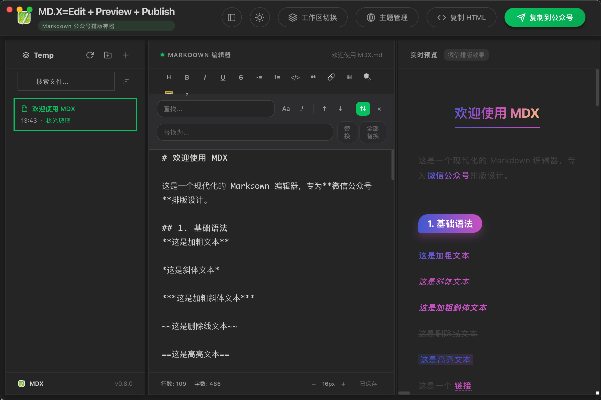

<p align="center">
  
</p>

<h1 align="center">MDX</h1>

<p align="center">
  <strong>更优雅的 Markdown 公众号排版工具</strong>
</p>

<p align="center">
  告别复杂工具。Markdown 写作，一键复制到公众号。<br>
  基于 WeMD 的桌面版，专为公众号创作者设计的<b>本地优先</b>编辑器。
</p>

<p align="center">
  <a href="https://wemd.app">🌐 WeMD官网</a> •
  <a href="https://edit.wemd.app">✏️ WeMD在线使用</a> •
  <a href="https://wemd.app/docs">📖 WeMD文档</a>
</p>




---

## ✨ 特性

|     | 功能              | 说明                                                   |
| --- | ----------------- | ------------------------------------------------------ |
| 📝  | **Markdown 语法** | 支持 GFM、表格、代码高亮、数学公式                     |
| 🎨  | **主题切换**      | 内置多款文章主题，支持可视化设计器或自定义 CSS         |
| 📋  | **一键复制**      | 针对微信公众号粘贴适配，尽量保持预览效果               |
| 📄  | **复制 HTML**     | 支持复制排版后的 HTML 内容，适配更多编辑场景           |
| 🖼️  | **图床支持**    | 本地图床，复制到公众号直接内嵌图片 |
| 💾  | **本地优先**      | 数据存储在本地，无需登录，隐私安全                     |
| 📱  | **跨平台**        | Web 端 + 桌面端（MacOS / Windows / Linux）             |
| 🌙  | **界面风格**      | 亮色 / 深色 双模式可选                                 |
| 👁️  | **深色模式预览**  | 预览微信深色模式效果，还原度达 98%+                    |
| 🔍  | **高级搜索**      | 支持正则匹配、全词匹配、批量替换                       |
| 🎞️  | **滑动图组**      | 支持水平滑动的多图展示组件，丰富视觉体验               |
| 📊  | **Mermaid 图表**  | 内置流程图、时序图、甘特图等多种图表，自动适配主题配色 |

---

## 💡 技术亮点

### 微信深色模式预览算法

MDX 内置了一套**色彩语义保全算法**，可在编辑器中预览微信公众号深色模式下的实际效果，还原度达 **98% 以上**。

> 该算法基于微信官方开源的 [wechatjs/mp-darkmode](https://github.com/wechatjs/mp-darkmode) 核心算法迁移并优化，旨在保证高性能 CSS 转换的同时提供最接近官方的渲染效果。

- 智能识别不同元素类型，分别优化
- HSL 色彩空间计算，确保视觉一致性

---

## 🚀 快速开始

### 桌面版下载

前往 [Releases](https://github.com/dinstone/mdx/releases) 下载对应平台安装包：

- **MacOS**：`MDX-<版本号>-arm64-mac.zip`（Apple Silicon）
- **Windows**：`MDX.Setup.<版本号>.exe`
- **Linux**：`MDX-<版本号>.AppImage`

> ⚠️ **macOS 用户注意**：首次打开时如提示"应用已损坏"，请在终端执行：
>
> ```bash
> xattr -cr /Applications/MDX.app
> ```
>
> ⚠️ **Windows 用户注意**：如 SmartScreen 提示"未知发布者"，点击「更多信息」→「仍要运行」
>
> ⚠️ **Linux 用户注意**：运行前需设置可执行权限：`chmod +x MDX.AppImage`

---

## 🛠️ 本地开发

### 环境要求

- Node.js ≥ 18
- pnpm ≥ 9（推荐 `corepack enable pnpm`）

### 安装与运行

```bash
# 安装依赖
pnpm install

# 启动 Web 开发服务器
pnpm dev:web

# 启动桌面端（会先启动 Web，再启动 wails3）
pnpm dev:wails
```

### 构建

```bash
# 构建 Web
pnpm build

# 构建桌面应用
pnpm release
```

---
